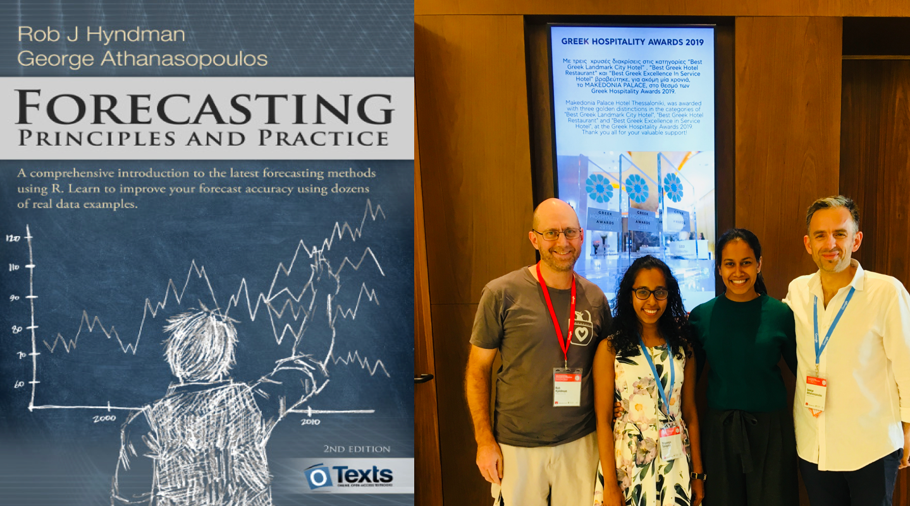
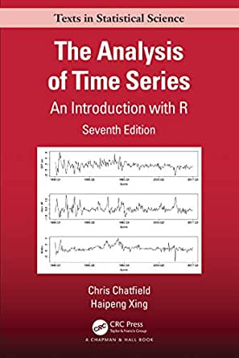

```{r setup, include=FALSE}
options(htmltools.dir.version = FALSE)
library(kableExtra)
```


```{r xaringan-themer, include=FALSE, warning=FALSE}
library(xaringanthemer)
style_duo_accent(
  primary_color = "#ffffff",
  title_slide_text_color = "#081d58", 
  secondary_color = "#ffffff",
  inverse_header_color = "#081d58",
  text_font_size = "1.2em",
  text_color = "#000",
  text_bold_color = "#fd8d3c",
  link_color = "#1f78b4",
  header_color = "#081d58",

  
)

```

class: center, middle, inverse


## Welcome to MA 5124 Financial Time Series Analysis & Forecasting!!!
--


## Dr. Priyanga D. Talagala

Senior Lecturer, Department of Computational Mathematics, University of Moratuwa

PhD in Statistics, 
Monash University, Australia

Email: priyangad@uom.lk <br/>

Web: prital.netlify.app

--

My research focuses on statistical machine learning, data mining and time series and forecasting

---
class: inverse, middle, center

# Course Outline Syllabus


---
## Teaching and learning approach

  * One 90 minutes lecture
  * One 90 minute computer lab session  

each week for 15 weeks.

- Online lectures via Zoom

---

## R and R studio

- Statistical software R will be used throughout this course.  
- R provides many ways to query, explore, and visualize data, make models from data, and perform statistical tests.

```{r   out.width = "50%", echo = FALSE, fig.cap='', fig.align='center'}
knitr::include_graphics("fig/Rstudio-Ball.png")
```

<!--- You don’t need to have any previous knowledge of this tools that will be used in this course.-->
---

class: middle
## Pre-requisites 

- MA5120 Introduction to Statistics
- You don’t need to have any previous knowledge of the statistical software tools that will be used in this course
---
class:  inverse, middle
## Key references
.pull-left[

Hyndman, R.J.& Athanasopoulos, G. (2020) ***Forecasting: principles and practice***, 3rd edition [OTexts.org/fpp3/](https://otexts.com/fpp3/)

  * Free and online
  * Data sets in associated R packages
  * R code for examples
]
  
.pull-right[ 

```{r   out.width = "100%", echo = FALSE, fig.cap='', fig.align='center'}

```
]
---

class:  inverse, middle
## Key references

.pull-left[

Chatfield, C., & Xing, H. (2019). The analysis of time series: an introduction with R. CRC press.

].pull-right[
```{r   out.width = "60%", echo = FALSE, fig.cap='', fig.align='center'}

```
]

---
class: middle
##  Assessment (Tentative plan)

Task | Value
---------|------------
Assignment 1 |  10%
Assignment 2 |  10%
Quiz 1 |  10%
End-semester examination   |  70%

---
class: middle
## Moodle site

- Includes all lecture notes, handouts, assignments
- Assignment submissions
- Forum for asking questions, etc.
- Announcements 


<!--

<span style="color: red;">
**Please don’t send emails. Use the forum.**
</span>
-->


