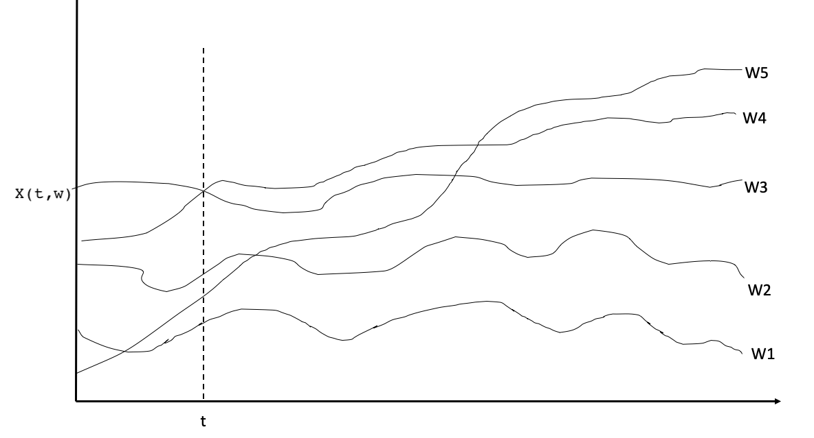

```{r setup, include=FALSE}
options(htmltools.dir.version = FALSE)
library(knitr)
opts_chunk$set(
  warning = FALSE,
  message = FALSE,
  cache = TRUE
)

# http://www.data.gov.lk/
library(fpp3)
library(patchwork)
library(gganimate)
library(tsibble)
library(dplyr)
library(fable)
library(tidyverse)

```

```{r xaringan-themer, include=FALSE, warning=FALSE}
library(xaringanthemer)
style_duo_accent(
  primary_color = "#ffffff",
  title_slide_text_color = "#081d58", 
  secondary_color = "#ffffff",
  inverse_header_color = "#081d58",
  text_font_size = "1.1em",
  text_color = "#000",
  text_bold_color = "#fd8d3c",
  link_color = "#1f78b4",
  header_color = "#081d58"

  
)
```

## Types of Data

1. Cross-sectional data
2. Time series data
3. Pooled data
3. Panel data

<!--Applied econometrics: yellow book (home) Dimitrios asteriou and stephen G. Hall-->

---
## 1. Cross-sectional data

- A cross-sectional data set consists of a sample of individuals, households, countries or any other type of unit at **a specific point in time.**
--

- Sometimes, data across all units do not correspond to exactly the same time point. 
--

- Example: A survey that collects data from questionnaire surveys of different units within a month. 
--

- In this case, we can ignore the minor time differences in collection. 

<!--and the data collected will still be viewed as a cross sectional data.-->
--
Eg: 

ID   | Monthly Income (in LKR)
-----|----------------------
1    |  83000
2    | 150000
3    | 40000
4    | 65000
---
background-image:url('fig/7_animal.png')
background-position: 50% 50%
background-size: 100%
class: right, top

---
## 2. Time series data

<!-- covid data: https://ourworldindata.org/grapher/daily-covid-cases-deaths?country=~LKA-->

- A time series is a sequence of observations taken **sequentially in time**.
--

- Time series data are arranged in chronological order and can have different time frequencies (eg: biannual, annual, quarterly, monthly, weekly, daily, hourly, etc.)
--
<!-- chronological: following the order in which they occurred.-->
- Examples of time series data
  - Annual Google profits
  - Monthly rainfall
  - Weekly retail sales
  - Daily confirmed dengue cases and deaths
  - Hourly electricity demand

---
background-image:url('fig/8_dengue.png')
background-position: 50% 50%
background-size: 60%
class: left, top
### District-wise weekly Dengue cases from 2006 to 2025
---
background-image:url('fig/8_exchangerate.png')
background-position: 50% 50%
background-size: 70%
class: right, top
---

## 3. Pooled data

- Pooled data occur when we have a “time series of cross sections,” but the observations in each cross section do not necessarily refer to the same unit.

--

## 4. Panel data

- This is a **special type** of pooled data in which the samples of the same cross-sectional units observed over time.

<!--at multiple points in time.-->
---
### Stochastic Processes

A stochastic process is a family of indexed random variables $\{X(t,\omega);t \in T;\omega \in \Omega\}$ defined on a probability space $(\Omega,\beta,\textbf{P})$ where $T$ is an arbitrary set.

```{r   out.width = "70%", echo = FALSE}

```

```{r eval=FALSE, echo=FALSE}
x <- matrix(rnorm(1000,5,5), nrow = 100)
colnames(x) <- paste("w", 1:10, sep = "")

data <- as_tibble(x) |>
  mutate(t=seq(100)) |>
  as_tsibble(index = t)
data_new<- data |> pivot_longer(cols= 1:10, names_to="Series", values_to="X(t,w)")
data_new <- data_new |> as_tsibble(key = Series)
data_new|> autoplot() +
  geom_vline(xintercept = 10)
```
---
There are many ways of visualizing a stochastic process.

  (i) For each choice of $t \in T$, $X(t, \omega)$ is a random variable.</br>
  (ii) For each choice of $\omega \in \Omega$, $X(t, \omega)$ is a function of $t$. </br>
  (iii) For each choice of $\omega$ and $t$, $X(t, \omega)$ is a number.</br>
  (iv) In general it is an ensemble (family) of functions $X(t, \omega)$ where $t$ and $w$ can take different possible values. 

```{r   out.width = "70%", echo = FALSE}

```

---

## Time series data

- **The observed time series or time series to be analyzed is a particular realization of a stochastic process.**
--

- Anything that is observed sequentially over time is a time series.
--

- In this course, we will only consider time series that are observed at **regular intervals of time.**
<!--(e.g., hourly, daily, weekly, monthly, quarterly, annually).-->
--

- **Irregularly spaced time series** can also possible, but are beyond the scope of this course

--

## Forecasting

- Forecasting is about **predicting the future** as accurately as possible, given all of the information available, including historical data and knowledge of any future events that might impact the forecasts.
--

- Forecasting is estimating how the sequence of observations will continue into the future.

---

## Factors affecting forecastability

Something is easier to forecast if:

 - we have a good understanding of the factors that contribute to it
 - there is lots of data available;
 - the forecasts cannot affect the thing we are trying to forecast.
 - there is relatively low natural/unexplainable random variation.
 - the future is somewhat similar to the past
 
---
## Types of Methods

- **Qualitative** forecasts
    - Judgmental forecasting is the only option if no historical data (for new product, new market conditions), or if the data available are not relevant to the forecasts. 
    - See fpp3 Chapter 6: https://otexts.com/fpp3/judgmental.html.
--
- **Quantitative** forecasts: can be applied 
  - if numerical information about the past is available
  - if it is reasonable to assume that some aspects of the past patterns will continue into the future
  
<!--when two conditions are satisfied-->
---
## Quantitative forecasts

- Most quantitative forecasting problems use either
  - Time series data (collected at regular intervals over time).
  - Cross-sectional data (collected at a single point in time).

<!-- explanation fpp3 Section 1.4-->

--
## Basic steps in a forecasting task

- Problem definition
- Collect data
- Preliminary (exploratory) analysis (data Visualization)
- Modelling
- Evaluate the fitted model
---

class: center, middle, inverse

# The statistical forecasting perspective

---

## Sample futures

```{r sltourist, echo=FALSE, eval = FALSE, message=FALSE, warning=FALSE, cache=TRUE, fig.width=12, fig.height=6}
library(datahut)
data <- touristsl  |> filter(Year>=1990)
fit <- data |> model(ETS())
```

```{r austa1adel, echo=FALSE, message=FALSE, warning=FALSE, cache=TRUE, fig.width=12, fig.height=6, eval = FALSE}
sim <- fit |> generate(h = 10, times = 10) |>
  mutate(
    replicate = factor(.rep, levels = 1:10, labels = paste("Future", 1:10))
  )
ggplot(data, aes(x = Year)) +
  geom_line(aes(y = Arrivals, colour = "Data")) +
  geom_line(aes(y = .sim, colour = replicate), data = sim) +
  ylab("Tourist Arrivals") + xlab("Year") +
  ggtitle("Tourist arrivals to Sri Lanka") +
  scale_colour_manual(values = c("#000000", rainbow(10)),
                      breaks = c("Data", paste("Future", 1:10)),
                      name = " ")
```

```{r austa1, echo=FALSE, message=FALSE, warning=FALSE, cache=TRUE, fig.width=9, fig.height=6}
austa <- as_tsibble(fpp2::austa) |>
  rename(Year = index, Visitors = value)
fit <- austa |> model(ETS())
```

```{r austa1a, echo=FALSE, message=FALSE, warning=FALSE, cache=TRUE, fig.width=12, fig.height=7}
sim <- fit |> generate(h = 10, times = 10) |>
  mutate(
    replicate = factor(.rep, levels = 1:10, labels = paste("Future", 1:10))
  )
ggplot(austa, aes(x = Year)) +
  geom_line(aes(y = Visitors, colour = "Data")) +
  geom_line(aes(y = .sim, colour = replicate), data = sim) +
  ylab("Millions of visitors") + xlab("Year") +
  ggtitle("Total international visitors to Australia") +
  scale_colour_manual(values = c("#000000", rainbow(10)),
                      breaks = c("Data", paste("Future", 1:10)),
                      name = " ")
```


<!--Explanation: Section 1.7 fpp3-->
---

## Forecast intervals

```{r austa2del, echo=FALSE, message=FALSE, warning=FALSE, cache=TRUE, fig.width=12, fig.height=7, eval = FALSE}
fit |>
  forecast(h = 10) |>
  autoplot(data) +
  ylab("Tourist Arrivals") + xlab("Year") +
  ggtitle("Forecasts of total tourist arrivals to Sri Lanka")
```

```{r austa2, echo=FALSE, message=FALSE, warning=FALSE, cache=TRUE, fig.width=12, fig.height=7}
fit |>
  forecast(h = 10) |>
  autoplot(austa) +
  ylab("Millions of visitors") + xlab("Year") +
  ggtitle("Forecasts of total international visitors to Australia")
```


---

## Statistical forecasting

- Thing to be forecast: a random variable, $y_t$.
- Forecast distribution: If ${\cal I}$ is all observations, then $y_{t} |{\cal I}$ means "the random variable $y_{t}$ given what we know in ${\cal I}$".
- The **point forecast** is the mean (or median) of $y_{t} |{\cal I}$
- The **forecast variance** is $\text{var}[y_{t} |{\cal I}]$
- A prediction interval or **interval forecast** is a range of values of $y_t$ with high probability.
- With time series, ${y}_{t|t-1} = y_t | \{y_1,y_2,\dots,y_{t-1}\}$. 
- $\hat{y}_{T+h|T} =\text{E}[y_{T+h} | y_1,\dots,y_T]$ (an $h$-step forecast taking account of all observations up to time $T$).

---

## Frequency of a time series: Seasonal periods

<!-- explanation: fpp3 Section 2.1 Seasonal period--> 

- **Frequency**: number of observation per natural time interval of measurement <!--(usually year, but sometimes a week, a day or an hour)-->

Data  |	Frequency
------|-------------
Annual | 	1
Quarterly |	4
Monthly |	12
Weekly |	52 or 52.18

---

## Frequency of a time series: Seasonal periods

- Multiple frequency setting

Data |	Minute |	Hour|	Day |	Week| Year
-----|---------|------|------|------|   
Daily	| | |	|		7	|365.25
Hourly ||	|		24|	168 |	8766
Half-Hourly|||			48|	336	|17532
Minutes	||	60|	1440|	10080	|525960
Seconds	|60|	3600|	86400	|604800|	31557600


---

.pull-left[

### Monthly time series

```{r, echo=FALSE, fig.height=5}
y <- ts(USAccDeaths, start=1949, frequency = 12)
autoplot(y)
```

- Length of the series: 72
- Monthly seasonality

]


.pull-right[

### Half-hourly Time Series

```{r, echo=FALSE, fig.height=5}
x <- msts(taylor, seasonal.periods=c(48,336), start=2000+22/52)
autoplot(x)
```

- Length of the series: 4032
- Daily seasonality and weekly seasonality
]
---

##  Time series patterns

- **Trend** pattern exists when there is a long-term increase or decrease in the data.
--

- **Seasonal** pattern exists when a series is influenced by seasonal factors (e.g., the quarter of the year, the month, or day of the week).
--

- **Cyclic** pattern exists when data exhibit rises and falls that are not of fixed frequency (duration usually of at least 2 years).

<!-- fpp3 : Section 2.3, Check goeorge 2- tsgraphics slide 29-->

---

## Seasonal or cyclic?

Differences between seasonal and cyclic patterns:

- seasonal pattern constant length; cyclic pattern variable length
- average length of cycle longer than length of seasonal pattern
- magnitude of cycle more variable than magnitude of seasonal pattern
--

- **The timing of peaks and troughs is predictable with seasonal data, but unpredictable in the long term with cyclic data.**

---

## Time series patterns


```{r, echo=FALSE, comment=NA, fig.width=12}
x <- 1:20
y <- 5*x+rnorm(20)
y <- ts(y, frequency = 1, start=1980)
autoplot(y)

```

---
## Time series patterns

```{r, echo=FALSE, comment=NA, fig.width=12}

autoplot(window(elec, start=1980)) +
ggtitle("Australian monthly electricity production") + xlab("Year") + ylab("GWh")

```

---

## Time series patterns

```{r, echo=FALSE, comment=NA, fig.width=12}

 autoplot(bricksq) +
ggtitle("Australian quarterly clay brick production") + xlab("Year") + ylab("million units")

```

---

## Time series patterns

```{r, echo=FALSE, comment=NA, fig.width=12}

 autoplot(hsales) +
ggtitle("Monthly Sales of new one-family houses, USA") + xlab("Year") + ylab("Total sales")

```
---

## Time series patterns

```{r, echo=FALSE, comment=NA, fig.width=12}

  autoplot(ustreas) +
ggtitle("US Treasury Bill Contracts") + xlab("Day") + ylab("price")

```

---

## Time series patterns

```{r, echo=FALSE, comment=NA, fig.width=12}

 autoplot(lynx) +
ggtitle("Annual Canadian Lynx Trappings") + xlab("Year") + ylab("Number trapped")

```
---

**Numerical data summaries**

- **Covariance** and **correlation**: measure extent of linear relationship between two variables (x and y).

$$r = \frac{\sum(x-\bar{x})(y-\bar{y})}{\sqrt{\sum(x-\bar{x})^2\sum(y-\bar{y})^2}}$$
- Lies between -1 and +1

```{r cor, fig.width=12, echo=FALSE}
library(patchwork)
set.seed(123)
x <- rnorm(100,0,4)
y <- (2 - 3*x) + rnorm(100, 0, 2)
data1 <- data.frame(x, y ) 
r1 <- round(cor(data1$x, data1$y),3)
p1 <- ggplot(data1, aes(x,y))+
  geom_point()+
  theme(aspect.ratio = 1) +
  ggtitle(paste("(a)(r=", r1, ")"))


x <- rnorm(100,0,4)
y <- (2 - 3*x) + rnorm(100, 0, 15)
data2 <- data.frame(x, y ) 
r2 <- round(cor(data2$x, data2$y),3)
p2 <- ggplot(data2, aes(x,y))+
  geom_point()+
  theme(aspect.ratio = 1) +
  ggtitle(paste("(b)(r=", r2, ")"))


x <- rnorm(100,0,4)
y <- (2 + 3*x) + rnorm(100, 0, 3)
data3 <- data.frame(x, y ) 
r3 <- round(cor(data3$x, data3$y),3)
p3 <- ggplot(data3, aes(x,y))+
  geom_point()+
  theme(aspect.ratio = 1) +
  ggtitle(paste("(c) (r=", r3, ")"))


x <- rnorm(100,0,4)
y <- (2 + 3*x) + rnorm(100, 0, 15)
data4 <- data.frame(x, y ) 
r4 <- round(cor(data4$x, data4$y),3)
p4 <- ggplot(data4, aes(x,y))+
  geom_point()+
  theme(aspect.ratio = 1) +
  ggtitle(paste("(d) (r=", r4, ")"))


x <- rnorm(100,0,15)
y <- rnorm(100,0,15)
data5 <- data.frame(x, y ) 
r5 <- round(cor(data5$x, data5$y),3)
p5 <- ggplot(data5, aes(x,y))+
  geom_point()+
  theme(aspect.ratio = 1) +
  ggtitle(paste("(e) (r=", r5, ")"))

x <- rnorm(1000,0,4)
y <- -(3*x^2) + rnorm(100, 0, 15)
data6 <- data.frame(x, y ) 
r6 <- round(cor(data6$x, data6$y),3)
p6 <- ggplot(data6, aes(x,y))+
  geom_point()+
  theme(aspect.ratio = 1) +
  ggtitle(paste("(e) (r=", r6, ")"))

#p<-gridExtra::grid.arrange(p1,p2,p3,p4,p5, ncol=5)

p <- (p1| p2 | p3 | p4 |p5)
print(p)
```

<!--- Lies between -1 and +1-->

---
## Correlation coefficient

Which one has the highest correlation?

```{r echo = FALSE, fig.width=12, results=FALSE, fig.height=6, message=FALSE, comment=FALSE}
#correlation
cor1 <- format(cor(anscombe$x1, anscombe$y1), digits=4)
cor2 <- format(cor(anscombe$x2, anscombe$y2), digits=4)
cor3 <- format(cor(anscombe$x3, anscombe$y3), digits=4)
cor4 <- format(cor(anscombe$x4, anscombe$y4), digits=4)

#define the OLS regression
line1 <- lm(y1 ~ x1, data=anscombe)
line2 <- lm(y2 ~ x2, data=anscombe)
line3 <- lm(y3 ~ x3, data=anscombe)
line4 <- lm(y4 ~ x4, data=anscombe)

circle.size = 2
colors = list('black', 'black', 'black', 'black')

#plot1
plot1 <- ggplot(anscombe, aes(x=x1, y=y1)) + geom_point(size=circle.size, pch=21, fill=colors[[1]]) +
  geom_abline(intercept=line1$coefficients[1], slope=line1$coefficients[2]) +
  theme(aspect.ratio = 1)

#plot2
plot2 <- ggplot(anscombe, aes(x=x2, y=y2)) + geom_point(size=circle.size, pch=21, fill=colors[[2]]) +
  geom_abline(intercept=line2$coefficients[1], slope=line2$coefficients[2]) +
   theme(aspect.ratio = 1)

#plot3
plot3 <- ggplot(anscombe, aes(x=x3, y=y3)) + geom_point(size=circle.size, pch=21, fill=colors[[3]]) +
  geom_abline(intercept=line3$coefficients[1], slope=line3$coefficients[2]) +
   theme(aspect.ratio = 1)

#plot4
plot4 <- ggplot(anscombe, aes(x=x4, y=y4)) + geom_point(size=circle.size, pch=21, fill=colors[[4]]) +
  geom_abline(intercept=line4$coefficients[1], slope=line4$coefficients[2]) +
   theme(aspect.ratio = 1)

p<-gridExtra::grid.arrange(plot1, plot2, plot3, plot4)
print(p)
```
--

- All these have $r=0.82$. 
- Visualization is very important
---
## Autocorrelation

**Auto**covariance $(c_k)$ and **auto**correlation $(r_k)$: measure linear relationship between lagged values of a time series $y$.
--

- We measure the relationship between:<br/>
   $y_t$ and $y_{t-1}$ <br/>
   $y_t$ and $y_{t-2}$ <br/>
   $y_t$ and $y_{t-3}$ <br/>
   $\dots$ <br/>
   $y_t$ and $y_{t-k}$
--

- We denote the sample autocovariance at lag $k$ by $c_k$ and the sample autocorrelation at lag $k$ by $r_k$. Then
define

$$r_k = \frac{c_k}{c_0} = \frac{\sum_{t=k+1}^{T}(y_t-\bar{y})(y_{t-k}-\bar{y})}{\sum_{t=1}^{T}(y_t-\bar{y})^2}$$
---
## Autocorrelation

- $r_1$ indicates how successive values of $y$ relate to each other
- $r_2$ indicates how $y$ values two periods apart relate to each other
- $r_k$ is almost the same as the sample correlation between $y_t$ and $y_{t−k}$.
   
<!--The Greek prefix auto- means "self. one's own, by oneself, of oneself" -->

---
**Autocorrelation: Results for first 9 lags for beer data:**

```{r echo=FALSE, fig.width=12, fig.height=3}
new_production <- aus_production |> filter(year(Quarter) >= 1992)
p <- autoplot(new_production)
p1<- p +
  geom_point()
print(p1)
```

```{r echo= FALSE, fig.width=12, fig.height=4}

p2<- new_production |> gg_lag(Beer, geom= "point")
p3<- new_production |> ACF(Beer, lag_max = 9) |> autoplot()

p<-gridExtra::grid.arrange(p2,p3, ncol=2)
```

---
**Autocorrelation: Results for first 9 lags for beer data:**

```{r echo = FALSE, fig.width=12, fig.height=3}

p3<- new_production |> ACF(Beer, lag_max = 9) |> autoplot()

print(p3)

```

- $r_4$ is **positive and higher** than for the other lags. This is due to the **seasonal pattern** in the data.
   - the peaks (troughs) tend to be 4 quarters apart.
   - the spikes every 4 lags after this $(r_8, r_{12}, \dots)$ decrease in size as the lag number increases.

---
**Autocorrelation: Results for first 9 lags for beer data:**

```{r echo = FALSE, fig.width=12, fig.height=3}

p3<- new_production |> ACF(Beer, lag_max = 9) |> autoplot()

print(p3)

```
- $r_2$ is **more negative** than for the other lags because troughs and peaks tend to be 2 quarters apart.
   - The highest and the lowest productions are 2 quarters apart.
   - The spikes every 4 lags after this $r_6, r_{10}, \dots$ decrease in size as the lag number increases.
- Together, the autocorrelations at lags $1, 2, \dots,$ make up the **autocorrelation** or **ACF**.
- The plot is known as a **correlogram**.
- The dashed blue lines indicate whether the correlations are significantly different from zero. 
---
## Trend and seasonality in ACF plots

- When data have a trend, the autocorrelations for small lags tend to be large and positive.
- When data are seasonal, the autocorrelations will be larger at the seasonal lags (i.e., at multiples of the seasonal frequency)
- When data are trended and seasonal, you see a combination of these effects
---
## Trend

```{r echo = FALSE, fig.width=12,  comment=FALSE, message=FALSE, warning=FALSE, fig.height=7}
x <- 1:70
y <- 5*x+rnorm(20,0,2)
y <- ts(y, frequency = 1, start=1950)
p1<- autoplot(y)

p2<- ggAcf(y, lag.max=40)

x <- 1:70
y <- -5*x+rnorm(20,0,2)
y <- ts(y, frequency = 1, start=1950)
p3<- autoplot(y)

p4<- ggAcf(y, lag.max=40)
#p<-gridExtra::grid.arrange(p1,p3,p2,p4, ncol=2)

p<-(p1|p3)/(p2|p4)
print(p)
```
---

## Google stock price

```{r echo = FALSE, fig.width=12,  comment=NA, message=FALSE, warning=FALSE, fig.height=7}
 google_2015 <- gafa_stock |>
filter(Symbol == "GOOG", year(Date) == 2015) |> select(Date, Close)

p1<-google_2015 |> autoplot()

google_2015 <- google_2015 |>
mutate(trading_day = row_number()) |> update_tsibble(index = trading_day, regular = TRUE)

p2<- google_2015 |>
ACF(Close, lag_max = 100) |> autoplot()
#p<-gridExtra::grid.arrange(p1,p2, ncol=1)

p <- p1/p2
print(p)


```
---

## Australian monthly electricity production

```{r echo = FALSE, fig.width=12,  comment=NA, message=FALSE, warning=FALSE, fig.height=7}

elec2 <- window(elec, start=1980)
p1<-autoplot(elec2)
p2<- ggAcf(elec2, lag.max=48)
# p<-gridExtra::grid.arrange(p1,p2, ncol=1)
p <- p1/p2
print(p)
```

<!--
- The slow decrease in the ACF as the lags increase is due to the trend, while the "scalloped" shape is due the seasonality.-->
---
## White noise

```{r echo = FALSE, fig.width=12, fig.height=5}
set.seed(1)

wn <- tsibble(t = seq(36), y = rnorm(36), index = t)
p <- wn |> autoplot(y)
print(p)
```

- **White noise data** is uncorrelated across time with zero mean and constant variance.
- Technically, we require independence as well.
<!--Random Walk. A random walk is another time series model where the current observation is equal to the previous observation with a random step up or down.-->
---

 **Sample autocorrelations for white noise series**

```{r echo = FALSE, fig.width=12, fig.height=6, message=FALSE, comment=NA, results=FALSE}
set.seed(1)

wn <- tsibble(t = seq(36), y = rnorm(36), index = t)
p1<- wn |> autoplot(y)
p2<- wn |> ACF(y) |> autoplot()
p<-gridExtra::grid.arrange(p1,p2, ncol=1)
print(p)
```


- For uncorrelated data, we would expect each one to be close to zero. 
- Blue lines show $95\%$ **critical values**.
---

## Sampling distribution of autocorrelations

```{r echo= FALSE, fig.width=12, fig.height=4}
p2<- wn |> ACF(y) |> autoplot()
print(p2)
```

- Sampling distribution of $r_k$ for white noise data is asymptotically $N(0,1/T)$.
- $95\%$ of all $r_k$ for white noise must lie within $\pm 1.96/ \sqrt{T}$.
- If this is not the case, the series is probably not WN.
- Common to plot lines at $\pm 1.96/ \sqrt{T}$ when plotting ACF. These are the **critical values**.
---

## Sampling distribution of autocorrelations

```{r echo= FALSE, fig.width=12, fig.height=4}
p2<- wn |> ACF(y) |> autoplot()
print(p2)
```

Example:

- $T = 36$ and so critical values at
$\pm 1.96/ \sqrt{36} = \pm 0.327$.
- All autocorrelation coefficients lie within these limits, confirming that the data are white noise. (More precisely, the data cannot be distinguished from white noise.

<!-- George note 2-tsgraphics slide 60-->

---

##Example

```{r echo = FALSE, fig.width=12,results=FALSE, fig.height=5}
data <- window(pigs, start=1990) 
p1 <- autoplot(data) +
xlab("Year") + ylab("thousands") + ggtitle("Time Series")

p2<- ggAcf(data)
p<-gridExtra::grid.arrange(p1,p2, ncol=1)
print(p)


```

- Difficult to detect pattern in time plot.
- ACF shows some significant autocorrelation at lags 1, 2, and 3.
- $r_{12}$ relatively large although not significant.This may indicate some slight seasonality.
- These show the series is **not a white noise series**.

---

## Which is which?

```{r, fig.height=7, fig.width=12, echo=FALSE, warning=FALSE}
library(patchwork)
cowtemp <- as_tsibble(fma::cowtemp)
USAccDeaths <- as_tsibble(USAccDeaths)
AirPassengers <- as_tsibble(AirPassengers)
mink <- as_tsibble(fma::mink)
tp1 <- autoplot(cowtemp, value) + xlab("") + ylab("chirps per minute") +
  ggtitle("1. Daily temperature of cow")
tp2 <- autoplot(USAccDeaths, value) + xlab("") + ylab("thousands") +
  ggtitle("2. Monthly accidental deaths")
tp3 <- autoplot(AirPassengers, value) + xlab("") + ylab("thousands") +
  ggtitle("3. Monthly air passengers")
tp4 <- autoplot(mink, value) + xlab("") + ylab("thousands") +
  ggtitle("4. Annual mink trappings")
acfb <- ACF(cowtemp, value) |> autoplot() + xlab("") + ggtitle("B") + ylim(-0.4,1)
acfa <- ACF(USAccDeaths, value) |> autoplot() + xlab("") + ggtitle("A") + ylim(-0.4,1)
acfd <- ACF(AirPassengers, value) |> autoplot() + xlab("") + ggtitle("D") + ylim(-0.4,1)
acfc <- ACF(mink, value) |> autoplot() + xlab("") + ggtitle("C") + ylim(-0.4,1)
(tp1 | tp2 | tp3 | tp4) / (acfa | acfb | acfc | acfd)
```

---
# References

- Hyndman, R. J., & Athanasopoulos, G. (2018). Forecasting: principles and practice. OTexts.
- Mathai, A. M., & Haubold, H. J. (2008). Applications to Stochastic Process and Time Series. Special Functions for Applied Scientists, 247-295.


