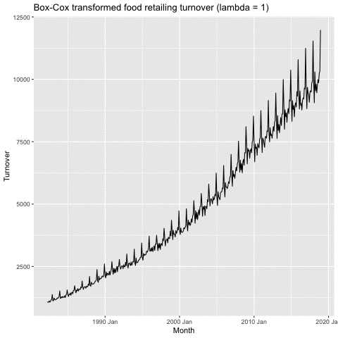
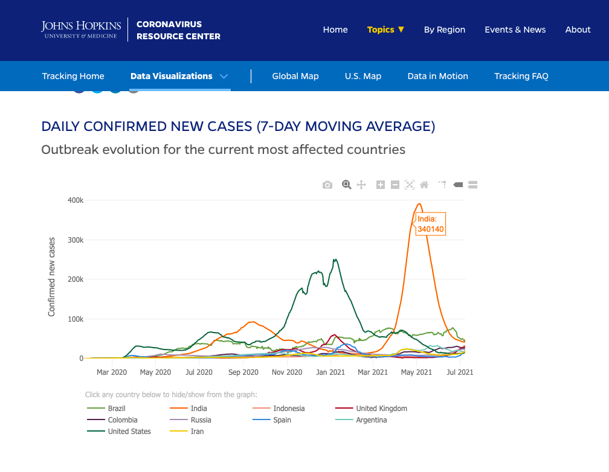

```{r setup, include=FALSE}
options(htmltools.dir.version = FALSE)
library(knitr)
opts_chunk$set(
  warning = FALSE,
  message = FALSE,
  fig.width=12,
  echo = FALSE
)

# http://www.data.gov.lk/
library(fpp3)
library(patchwork)
library(gganimate)
library(tsibble)
library(dplyr)
library(fable)
library(tidyverse)

# install.packages("mozzie")
#library(mozzie)

# to use the animation
# devtools::install_github("thomasp85/transformr")
#library(transformr)
```


```{r xaringan-themer, include=FALSE, warning=FALSE}
library(xaringanthemer)
style_duo_accent(
  primary_color = "#081d58",
  title_slide_text_color = "#edf8b1",
  secondary_color = "#43a383",
  inverse_header_color = "#081d58",
  text_font_size = "1.1em",
  text_color = "#000",
  text_bold_color = "#fd8d3c",

  
)

```

class: center, middle, inverse
# Transformations and adjustments

---
## Per capita adjustments

```{r gdp-per-capita, echo=TRUE,out.width="60%"}
global_economy |>
  filter(Country == "Sri Lanka") |>
  autoplot(GDP)
```
---
## Per capita adjustments

```{r gdp-per-capita2,  echo=TRUE, out.width="60%"}
global_economy |>
  filter(Country == "Sri Lanka") |>
  autoplot(GDP / Population)
```
---
## Mathematical transformations

- If the data show different variation at different levels of the series, then a transformation can be useful.
- Denote original observations as $y_1,\dots,y_n$ and transformed
observations as $w_1, \dots, w_n$.
- Mathematical transformations for stabilizing variation

Transformation | Equation  
-----------|-------------
Square root | $w_t = \sqrt{y_t}$  
Cube root | $w_t = \sqrt[3]{y_t}$ 
Logarithm | $w_t = \log(y_t)$  
- Logarithms, in particular, are useful because they are more interpretable: changes in a log value are **relative (percent) changes on the original scale**.


---
## Mathematical transformations

```{r food, echo=TRUE}
food <- aus_retail |>
  filter(Industry == "Food retailing") |>
  summarise(Turnover = sum(Turnover))
```

```{r food-plot, echo = TRUE, fig.height=4}
food |> autoplot(Turnover) +
  labs(y = "Turnover ($AUD)")
```

---

## Mathematical transformations

```{r food-sqrt1, echo=TRUE, fig.height=5}
food |> autoplot(sqrt(Turnover)) +
  labs(y = "Square root turnover")
```
---
## Mathematical transformations

```{r food-cbrt, echo=TRUE, fig.height=5}
food |> autoplot(Turnover^(1/3)) +
  labs(y = "Cube root turnover")
```
---
## Mathematical transformations

```{r food-log, echo=TRUE, fig.height=5}
food |> autoplot(log(Turnover)) +
  labs(y = "Log turnover")
```
---
## Mathematical transformations


```{r food-inverse, echo=TRUE, fig.height=5}
food |> autoplot(-1/Turnover) +
  labs(y = "Inverse turnover")
```
---
## Box-Cox transformations

- Each of these transformations is close to a member of the
family of **Box-Cox transformations**:

$$w_t = \left\{\begin{array}{ll}\log(y_t),      & \quad \lambda = 0; \\(y_t^\lambda-1)/\lambda ,         & \quad \lambda \ne 0.
\end{array} \right.$$

* $\lambda=1$: (No substantive transformation)
* $\lambda=\frac12$: (Square root plus linear transformation)
* $\lambda=0$: (Natural logarithm)
* $\lambda=-1$: (Inverse plus 1)

---
## Box-Cox transformations 


```{r food-anim, cache=TRUE, echo=FALSE, fig.show='animate', interval=1/10, message=FALSE, fig.height=3, fig.width=13, aniopts='controls,buttonsize=0.3cm,width=9.5cm', eval =FALSE}
p<- food |>
  mutate(!!!set_names(map(seq(0, 1, 0.01), ~ expr(fabletools::box_cox(Turnover, !!.x))), seq(0, 1, 0.01))) |>
  select(-Turnover) |>
  pivot_longer(-Month, names_to = "lambda", values_to = "Turnover") |>
  mutate(lambda = as.numeric(lambda)) |>
  ggplot(aes(x = Month, y = Turnover)) +
  geom_line() +
  transition_states(1 - lambda, state_length = 0) +
  view_follow() +
  ggtitle("Box-Cox transformed food retailing turnover (lambda = {format(1 - as.numeric(closest_state), digits = 2)})")

```


```{r   echo=FALSE, out.width = "50%", fig.align='center'}

```
---
## Box-Cox transformations

```{r food-lambda, echo=TRUE}
food |>
  features(Turnover, features = guerrero)
```

- This attempts to balance the seasonal fluctuations and random variation across the series.
- Always check the results.
- A low value of $\lambda$ can give extremely large prediction intervals.
---
## Box-Cox transformations

.pull-left[

```{r  echo=TRUE, fig.width=13, fig.height=10}
food |> 
  autoplot(Turnover) 
```

]
.pull-right[
```{r food-bc, echo=TRUE,fig.width=13,  fig.height=10}
food |> 
autoplot(box_cox(Turnover, 0.0524)) 
```

]
---
## Transformations

* Often no transformation needed.
* Simple transformations are easier to explain and work well enough.
* Transformations can have very large effect on PI.
* If the data contains zeros, then don't take logs.
* `log1p()` can be useful for data with zeros.
* If some data are negative, no power transformation is possible unless a constant is added to all values.
* Choosing logs is a simple way to force forecasts to be positive
* Transformations must be reversed to obtain forecasts on the original scale. (Handled automatically by `fable`.)

<!--Why is a Box-Cox transformation unhelpful for the canadian_gas data?-->

---
class: center, middle, inverse

# Time series components
---

## RECALL: Time series patterns


- **Trend** pattern exists when there is a long-term increase or decrease in the data.
- **Seasonal** pattern exists when a series is influenced by seasonal factors (e.g., the quarter of the year, the month, or day of the week).
- **Cyclic** pattern exists when data exhibit rises and falls that are not of fixed frequency (duration usually of at least 2 years).

---
## Time series decomposition

$$y_t = f(S_t, T_t, R_t)$$

where 
   - $y_t=$ data at period $t$
   - $T_t=$ trend-cycle component at period $t$
   - $S_t=$ seasonal component at period $t$
   - $R_t=$ remainder component at period $t$


**Additive decomposition:** $y_t = S_t + T_t + R_t.$

**Multiplicative decomposition:** $y_t = S_t \times T_t \times R_t.$

---
## Time series decomposition

* Additive model  appropriate if  magnitude of  seasonal fluctuations does not vary with level.
* If seasonal are proportional to level of series, then multiplicative model appropriate.
* Multiplicative decomposition more prevalent with economic series
* Alternative: use a Box-Cox transformation, and then use additive decomposition.
* Logs turn multiplicative relationship into an additive relationship:

$$y_t = S_t \times T_t \times E_t \quad\Rightarrow\quad
\log y_t = \log S_t + \log T_t + \log R_t.$$
---
## US Retail Employment

```{r usretail, echo = TRUE, fig.height=5}
library(fpp3)
us_retail_employment <- us_employment |>
  filter(year(Month) >= 1990, Title == "Retail Trade") |>
  select(-Series_ID)
us_retail_employment
```


---
## US Retail Employment

```{r dable1, fig.width=13, fig.height=5, echo = TRUE}
us_retail_employment |>
  autoplot(Employed) +
  xlab("Year") + ylab("Persons (thousands)") +
  ggtitle("Total employment in US retail")
```
---

## US Retail Employment

```{r dable2, echo = TRUE}
us_retail_employment |>
  model(stl = STL(Employed))
```
---
## US Retail Employment

```{r dable3, echo = TRUE}
dcmp <- us_retail_employment |>
  model(stl = STL(Employed))
components(dcmp)
```
---

## US Retail Employment

```{r dable4,echo = TRUE, fig.width=13, fig.height=5 }
us_retail_employment |>
  autoplot(Employed, color='gray') +
  autolayer(components(dcmp), trend, color='red') +
  xlab("Year") + ylab("Persons (thousands)") +
  ggtitle("Total employment in US retail")
```
---
## US Retail Employment

```{r usretail-stl, fig.width=13, fig.height=5, echo=TRUE}
components(dcmp) |> autoplot() + xlab("Year")
```

---

## US Retail Employment

```{r usretail3, echo=TRUE,  fig.height=5}
components(dcmp) |> gg_subseries(season_year)
```
---

## Seasonal adjustment

*  Useful by-product of decomposition:  an easy way to calculate seasonally adjusted data.
*  Additive decomposition: seasonally adjusted data given by
$$y_t - S_t = T_t + R_t$$
*  Multiplicative decomposition: seasonally adjusted data given by
$$y_t / S_t = T_t \times R_t$$

---
## US Retail Employment

```{r usretail-sa, echo=TRUE, fig.width=13, fig.height=5}
us_retail_employment |>
  autoplot(Employed, color='gray') +
  autolayer(components(dcmp), season_adjust, color='blue') +
  xlab("Year") + ylab("Persons (thousands)") +
  ggtitle("Total employment in US retail")
```

---

## Seasonal adjustment

  * We use estimates of $S$ based on past values to seasonally adjust a current value.
  *  Seasonally adjusted series reflect **remainders** as well as **trend**. Therefore they are not "smooth" and "downturns" or "upturns" can be misleading.
  *  It is better to use the trend-cycle component to look for turning points.


---
## Moving Averages


- The simplest estimate of the trend-cycle uses **moving averages**.

$m$-MA

$$\hat{T}_t=\frac{1}{m}\sum_{j=-k}^{k}y_{t+j}$$

where $m=2k+1$

---
## Moving averages

```{r fig.width=13, fig.height=7, echo=FALSE}
global_economy |>
filter(Country == "Australia", Year >=2000) |> autoplot(Exports) +
xlab("Year") + ylab("% of GDP") + ggtitle("Total Australian exports")
```
---
## Moving averages
```{r echo=FALSE}
aus_exports <- global_economy |> filter(Country == "Australia", Year >=2000) |> mutate( `3-MA` = slider::slide_dbl(Exports, mean, .before=1, .after=1, .complete=TRUE),
`5-MA` = slider::slide_dbl(Exports, mean, .before=2, .after=2, .complete=TRUE), `7-MA` = slider::slide_dbl(Exports, mean, .before=3, .after=3, .complete=TRUE) ) |>
  select(Year, Exports, `3-MA`, `5-MA`, `7-MA`)

print(aus_exports)
```
---
## Moving averages

```{r echo=FALSE, fig.height=6, fig.width=13}
aus_exports <- global_economy |> filter(Country == "Australia") |> mutate( `3-MA` = slider::slide_dbl(Exports, mean, .before=1, .after=1, .complete=TRUE),
`5-MA` = slider::slide_dbl(Exports, mean, .before=2, .after=2, .complete=TRUE), `7-MA` = slider::slide_dbl(Exports, mean, .before=3, .after=3, .complete=TRUE), `9-MA` = slider::slide_dbl(Exports, mean, .before=4, .after=4, .complete=TRUE)  ) |>
  select(Year, Exports, `3-MA`, `5-MA`, `7-MA`, `9-MA`)

data<- aus_exports |> 
  pivot_longer(cols = c( `3-MA`, `5-MA`, `7-MA`, `9-MA`), names_to = "MA") |> as_tsibble(key=MA, index= Year)  
p<- data |> autoplot(Exports, color="gray") +
  autolayer(data, value, color="red")+
  facet_wrap("MA")

print(p)
```

---
## Moving averages

- So a moving average is an **average of nearby points**
- observations nearby in time are also likely to be **close in value**.
- average eliminates some **randomness** in the data, leaving a **smooth trend-cycle** component.

$$3-MA: \hat{T}_t = \frac{(y_{t−1} + y_t + y_{t+1})}{3}$$
$$5-MA: \hat{T}_t = \frac{(y_{t−2} + y_{t−1} + y_t + y_{t+1}+y_{t+2})}{5}$$
- each average computed by dropping **oldest** observation and including **next** observation.
- averaging **moves** through time series until trend-cycle computed at each observation possible
---
## Endpoints

**Why is there no estimate at ends**

  - For a 3-MA, there cannot be estimates at time 1 or time $n$ because the observations at time 0 and $n + 1$ are not available.
  - Generally: there cannot be estimates at times near the endpoints.

**The order of the MA**

  - larger order means smoother, flatter curve
  - larger order means more points lost at ends 
  
---

## Moving averages of moving averages

- Centered MA

## Moving averages
```{r echo=FALSE}
aus_exports <- global_economy |> filter(Country == "Australia", Year >=2000) |> mutate( `4-MA` = slider::slide_dbl(Exports, mean, .before=1, .after=2, .complete=TRUE),
`2*4-MA` = slider::slide_dbl(`4-MA`, mean, .before=1, .after=0, .complete=TRUE) ) |>
  select(Year, Exports, `4-MA`, `2*4-MA`)

print(aus_exports)
```
---

## Estimating the trend-cycle with seasonal data

- A moving average of the same length as the season removes the seasonal pattern.
- For quarterly data: use a $2\times 4 MA$ 
- For monthly data: use a $2\times 12 MA$

```{r echo=FALSE, fig.width=13, fig.height=5}
us_retail_employment_ma <- us_retail_employment |> mutate(`12-MA` = slider::slide_dbl(Employed, mean, .before=5,.after=6, .complete=TRUE),
`2x12-MA` = slider::slide_dbl(`12-MA`, mean, .before=1, .after=0, .complete=TRUE))


us_retail_employment_ma |>
autoplot(Employed, color='gray') + autolayer(us_retail_employment_ma, vars(`2x12-MA`), color='red') + xlab("Year") + ylab("Persons (thousands)") +
ggtitle(" A 2X12-MA applied to the US retail employment series")
```
---
## Weighted moving averages

**Weighted MA**

$$T_t=\sum_{j=-k}^{k}a_jy_{t+j}$$
where $k = (m − 1)/2$ is the half-width and the weights are denoted by $[a_{−k}, . . . , a_k]$.
- Simple $m$-MA: all weights equal to $1/m$. 
- Require sum of $a_j =1$ and $a_j =a_{−j}$. 
- Weighted MA are smoother.
---

```{r   echo=FALSE, out.width = "70%", fig.align='center'}

```

https://coronavirus.jhu.edu/data/new-cases
---
## Trend-cycle

- Multiplicative decomposition: $y_t = T_t\times S_t \times R_t = \hat{T}_t \times \hat{S}_t \times \hat{R}_t$
- Additive decomposition: $y_t = T_t+ S_t + R_t = \hat{T}_t +\hat{S}_t + \hat{R}_t$
- Estimate $\hat{T}$ using $(2\times m)$-MA if $m$ is even. Otherwise, estimate $\hat{T}$ using $m$-MA
- Compute de-trended series   
   - Multiplicative decomposition: $y_t/\hat{T}_t$
   - Additive decomposition: $y_t-\hat{T}_t$ 
  
**De-trending**

 Remove smoothed series $\hat{T}_t$ from $y_t$ to leave $S_t$ and $R_t$.    
  - Multiplicative model: $\frac{y_t}{\hat{T}_t} = \frac{\hat{T}_t \times \hat{S}_t \times \hat{R}_t}{\hat{T}_t}= \hat{S}_t \times \hat{R}_t$
  - Additive model: 
  $y_t- \hat{T}_t = (\hat{T}_t + \hat{S}_t + \hat{R}_t)-\hat{T}_t= \hat{S}_t +\hat{R}_t$
  
---
## Classical decomposition

- Choose additive or multiplicative depending on which gives the most stable components.
- Estimate of trend is unavailable for first few and last few observations.
- Seasonal component repeats from year to year. May not be realistic.
- Not robust to outliers.
- Newer methods designed to overcome these problems.
---
class: center, middle, inverse
# History of time series decomposition
---
## History of time series decomposition

  *  Classical method originated in 1920s.
  *  Census II method introduced in 1957. Basis for X-11 method and variants (including X-12-ARIMA, X-13-ARIMA)
  *  STL method introduced in 1983
  *  TRAMO/SEATS introduced in 1990s.

---
## STL decomposition

  *  STL: "Seasonal and Trend decomposition using Loess"
  *  Very versatile and robust.
  *  Unlike X-12-ARIMA, STL will handle any type of seasonality.
  *  Seasonal component allowed to change over time, and rate of change controlled by user.
  *  Smoothness of trend-cycle also controlled by user.
  *  Robust to outliers
  *  Not trading day or calendar adjustments.
  *  Only additive.
  *  Take logs to get multiplicative decomposition.
  *  Use Box-Cox transformations to get other decompositions.

---
## STL decomposition

```{r stlwindow5, echo=TRUE, warning=FALSE, fig.width=13, fig.height=5}
us_retail_employment |>
  model(STL(Employed ~ season(window=5), robust=TRUE)) |>
  components() |> autoplot() +
    ggtitle("STL decomposition: US retail employment")
```
---
## STL decomposition

```{r stlwindow9, echo=TRUE, warning=FALSE, fig.width=13, fig.height=5}
us_retail_employment |>
  model(STL(Employed ~ season(window=9), robust=TRUE)) |>
  components() |> autoplot() +
    ggtitle("STL decomposition: US retail employment")
```
---

## STL decomposition

```{r stlwindow55, echo=TRUE, warning=FALSE, fig.width=13, fig.height=5}
us_retail_employment |>
  model(STL(Employed ~ season(window=55), robust=TRUE)) |>
  components() |> autoplot() +
    ggtitle("STL decomposition: US retail employment")
```
---
## STL decomposition

```{r echo = TRUE, results = 'hide'}
us_retail_employment |>
  model(STL(Employed ~ season(window=5))) |>
  components()

us_retail_employment |>
  model(STL(Employed ~ trend(window=15) +
                       season(window="periodic"),
            robust = TRUE)
  ) |> components()
```

  *  `trend(window = ?)` controls wiggliness of trend component.
  *  `season(window = ?)` controls variation on seasonal component.
  *  `season(window = 'periodic')` is equivalent to an infinite window.
  
---
## STL decomposition

```{r mstl, fig.width=13, fig.height=6}
us_retail_employment |>
  model(STL(Employed)) |>
  components() |>
  autoplot()
```

* `STL()` chooses `season(window=13)` by default
* Can include transformations.

---
## STL decomposition

* Algorithm that updates trend and seasonal components iteratively.
* Starts with $\hat{T}_t=0$
* Uses a mixture of loess and moving averages to successively refine the trend and seasonal estimates.
* The trend window controls loess bandwidth applied to deasonalised values.
* The season window controls loess bandwidth applied to detrended subseries.
* Default season `window = 13`
* Default trend 
`window = nextodd( ceiling((1.5*period)/(1-(1.5/s.window)))`

---
# References

- Hyndman, R. J., & Athanasopoulos, G. (2018). Forecasting: principles and practice. OTexts.


