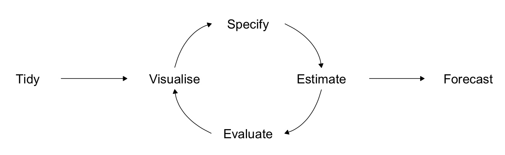

```{r setup, include=FALSE}
options(htmltools.dir.version = FALSE)
library(knitr)
opts_chunk$set(
  warning = FALSE,
  message = FALSE,
  fig.width=12,
  echo = FALSE,
  cache = TRUE
)

# http://www.data.gov.lk/
library(fpp3)
library(patchwork)
library(gganimate)
library(tsibble)
library(dplyr)
library(fable)
library(tidyverse)

# install.packages("mozzie")
#library(mozzie)

# to use the animation
# devtools::install_github("thomasp85/transformr")
#library(transformr)
```


```{r xaringan-themer, include=FALSE, warning=FALSE}
library(xaringanthemer)
style_duo_accent(
  primary_color = "#081d58",
  title_slide_text_color = "#edf8b1",
  secondary_color = "#43a383",
  inverse_header_color = "#081d58",
  text_font_size = "1.1em",
  text_color = "#000",
  text_bold_color = "#fd8d3c",

  
)
```
class:inverse, middle, center

# Useful tools for different forecasting situations


---
## A tidy forecasting workflow

The process of producing forecasts can be split up into a few fundamental steps.

```{r   echo=FALSE, out.width = "70%", fig.align='center'}

```

1. 1 Preparing data
2. 2 Data visualisation
3. 3 Specifying a model
4. 4 Model estimation
5. 5 Accuracy and performance evaluation
6. 6 Producing forecasts


<!--
```{r workflow, echo = FALSE, fig.cap="A tidy forecasting workflow"}
line_curve <- function(x, y, xend, yend, ...){
  geom_curve(
    aes(x = x, y = y, xend = xend, yend = yend),
    arrow = arrow(type = "closed", length = unit(0.03, "npc")),
    ...
  )
}

ggplot() +
  geom_text(
    aes(x = x, y = y, label = label),
    data = tribble(
      ~ x, ~ y, ~ label,
      1, 0, "Tidy",
      7/3, 0, "Visualise",
      3, 0.5, "Specify",
      11/3, 0, "Estimate",
      3, -0.5, "Evaluate",
      5, 0, "Forecast"
    ),
    size = 8
  ) +
  geom_segment(
    aes(x = x, y = y, xend = xend, yend = yend),
    data = tribble(
      ~ x, ~ y, ~ xend, ~ yend,
      1.3, 0, 1.9, 0,
      4.1, 0, 4.6, 0
    ),
    arrow = arrow(type = "closed", length = unit(0.03, "npc"))
  ) +
  line_curve(7/3, 0.1, 8/3, 0.5, angle = 250, curvature = -0.3) +
  line_curve(10/3, 0.5, 11/3, 0.1, angle = 250, curvature = -0.3) +
  line_curve(8/3, -0.5, 7/3, -0.1, angle = 250, curvature = -0.3) +
  line_curve(11/3, -0.1, 10/3, -0.5, angle = 250, curvature = -0.3) +
  theme_void() +
  xlim(0.8, 5.2) +
  ylim(-0.6, 0.6) +
  coord_equal(ratio = 1)
```
-->


---
class: center, middle, inverse
# Some simple forecasting methods

--
```{r   echo=FALSE, out.width = "100%", fig.align='center'}
knitr::include_graphics("fig/16box.jpg")
```

---

## Some simple forecasting methods

```{r ausbeer, fig.height=6, fig.width=13, echo=FALSE}
new_production <- aus_production |>
  filter(year(Quarter) >= 1992)
new_production |> autoplot(Beer) +
  xlab("Year") + ylab("megalitres") +
    ggtitle("Australian quarterly beer production")
```

How would you forecast these series?
---
## Some simple forecasting methods

```{r GDP-plot2, fig.height = 6, fig.width=13, echo=FALSE}
global_economy |>
  filter(Country=="Sri Lanka") |>
  autoplot(GDP) +
    ggtitle("GDP for Sri Lanka") 
```

How would you forecast these series?
---
## Some simple forecasting methods

```{r dj, fig.height=6, fig.width=13, echo=FALSE}
gafa_stock |>
  filter(Symbol == "FB", Date >= ymd("2018-01-01")) |>
  autoplot(Close) +
  labs(title = "Facebook closing stock price in 2018",
       x = NULL, y = "Closing price ($USD)")
```

How would you forecast these series?


---
## Some simple forecasting methods

### `MEAN(y)`: Average method

  * Forecasts of all future values is equal to mean of historical data $\{y_1,\dots,y_T\}$.
  * Forecasts: $\hat{y}_{T+h|T} = \bar{y} = (y_1+\dots+y_T)/T$
  
`fit <- bricks |> model(MEAN(Bricks))`

```{r mean-method-explained, echo=FALSE, message=FALSE, warning=FALSE, fig.height = 4, fig.width=10}
bricks <- aus_production |>
  filter(!is.na(Bricks)) |>
  mutate(average = mean(Bricks))

fc <- bricks |>
  filter(row_number() == n()) |> as_tibble() |>
  unnest(Quarter = list(as.Date(Quarter) + months(c(0, 12*5))))

bricks |>
  ggplot(aes(x = Quarter, y = Bricks)) +
  geom_line() +
  geom_line(aes(y = average), colour = "blue", linetype = "dashed") +
  geom_line(aes(y = average), data = fc, colour = "blue") +
  ggtitle("Clay brick production in Australia")
```

---

## Some simple forecasting methods

### `NAIVE(y)`: Naïve method

  * Forecasts equal to last observed value.
  * Forecasts: $\hat{y}_{T+h|T} =y_T$.

`fit <- bricks |> model(NAIVE(Bricks))`

```{r naive-method-explained, echo = FALSE, warning = FALSE, fig.height = 4, fig.width=10}
bricks |>
  filter(!is.na(Bricks)) |>
  model(NAIVE(Bricks)) |>
  forecast(h = "5 years") |>
  autoplot(filter(bricks, year(Quarter) > 1990), level = NULL) +
  geom_point(data = slice(bricks, n()), aes(x= Quarter, y=Bricks), colour = "blue") +
  ggtitle("Clay brick production in Australia")
```

---

## Some simple forecasting methods

### `SNAIVE(y ~ lag(m))`: Seasonal naïve method

  * Forecasts equal to last value from same season.
  * Forecasts: $\hat{y}_{T+h|T} =y_{T+h-m(k+1)}$, where $m=$ seasonal period and $k$ is the integer part of $(h-1)/m$.

`fit <- bricks |> model(SNAIVE(Bricks~lag("year")))`

```{r snaive-method-explained, echo = FALSE, warning = FALSE, fig.height = 3, fig.width=10}
bricks |>
  model(SNAIVE(Bricks ~ lag("year"))) |>
  forecast(h = "5 years") |>
  autoplot(filter(bricks, year(Quarter) > 1990), level = NULL) +
  geom_point(data = slice(bricks, (n()-3):n()),  aes(x= Quarter, y=Bricks), colour = "blue") +
  ggtitle("Clay brick production in Australia")
```

---

## Some simple forecasting methods

### `RW(y ~ drift())`: Drift method

 * Forecasts equal to last value plus average change.
 * Forecasts:


$$\hat{y}_{T+h|T} =  y_{T} + \frac{h}{T-1}\sum_{t=2}^T (y_t-y_{t-1})$$

$$= y_T + \frac{h}{T-1}(y_{T} -y_1)$$.

   * Equivalent to extrapolating a line drawn between first and last observations.
---
## Some simple forecasting methods

### Drift method

`bricks |> model(RW(Bricks ~ drift()))`

```{r drift-method-explained, echo = FALSE, warning = FALSE, fig.height = 5, fig.width=10}
aus_production |>
  filter(!is.na(Bricks)) |>
  model(RW(Bricks ~ drift())) |>
  forecast(h = "5 years") |>
  autoplot(aus_production, level = NULL) +
  geom_line(data = slice(aus_production, range(cumsum(!is.na(Bricks)))),  aes(x= Quarter, y=Bricks),
            linetype = "dashed", colour = "blue") +
  ggtitle("Clay brick production in Australia")
```

---
## Model fitting

The `model()` function trains models to data.

```{r brick-model, echo=TRUE}
brick_fit <-  aus_production |>
  filter(!is.na(Bricks)) |>
  model(
    Seasonal_naive = SNAIVE(Bricks),
    Naive = NAIVE(Bricks),
    Drift = RW(Bricks ~ drift()),
    Mean = MEAN(Bricks)
  )

brick_fit
```


A `mable` is a model table, each cell corresponds to a fitted model.
---
## Producing forecasts

```{r brick-fc, echo = TRUE, dependson='brick-model'}
brick_fc <- brick_fit |>
  forecast(h = "5 years")

print(brick_fc)
```


A `fable` is a forecast table with point forecasts and distributions.
---
## Visualising forecasts


```{r brick-fc-plot, echo=TRUE, warning=FALSE, message=FALSE, fig.height= 5, fig.width=13, dependson='brick-fc'}
brick_fc |>
  autoplot(aus_production, level = NULL) +
  ggtitle("Forecasts for quarterly clay brick production") +
  xlab("Year") + ylab("Millions of bricks") +
  guides(colour = guide_legend(title = "Forecast"))
```

---
class: center, middle, inverse
# Residual diagnostics
---
## Fitted values

 - $\hat{y}_{t|t-1}$ is the forecast of $y_t$ based on observations $y_1,\dots,y_{t-1}$.
 - We call these "fitted values".
 - Sometimes drop the subscript: $\hat{y}_t \equiv \hat{y}_{t|t-1}$.


### For example:

 - $\hat{y}_{t} = \bar{y}$ for average method.
 - $\hat{y}_{t} = y_{t-1} + (y_{T}-y_1)/(T-1)$ for drift method.
---
## Forecasting residuals

**Residuals in forecasting:** difference between observed value and its fitted value: $e_t = y_t-\hat{y}_{t|t-1}$.

### Assumptions

  1. 1 $\{e_t\}$ uncorrelated. If they aren't, then information left in  residuals that should be used in computing forecasts.
  2. 2 $\{e_t\}$ have mean zero. If they don't, then forecasts are biased.

### Useful properties (for distributions and prediction intervals)

  3. 3 $\{e_t\}$ have constant variance.
  4. 4 $\{e_t\}$ are normally distributed.


---
## Facebook closing stock price

```{r fbf, fig.height=4, fig.width=13, echo=TRUE}
fb_stock <- gafa_stock |>
  filter(Symbol == "FB") |>
  mutate(trading_day = row_number()) |>
  update_tsibble(index = trading_day, regular = TRUE)
fb_stock |> autoplot(Close)
```
---
## Facebook closing stock price

```{r augment, echo=TRUE,comment=NA}
fit <- fb_stock |> model(NAIVE(Close))
fit 

augment(fit)
```

<!-- explain refer rob's slides"-->

---
## Facebook closing stock price

```{r dj4, echo=TRUE, warning=FALSE, fig.height=5, fig.width=13}
augment(fit) |>
  ggplot(aes(x = trading_day)) +
  geom_line(aes(y = Close, colour = "Data")) +
  geom_line(aes(y = .fitted, colour = "Fitted"))
```

<!--1149 jump, 2018-07-26 -->


---
## Facebook closing stock price

```{r dj4a, echo=TRUE, warning=FALSE, fig.height=5, fig.width=13}
augment(fit) |>
  filter(trading_day > 1100) |>
  ggplot(aes(x = trading_day)) +
  geom_line(aes(y = Close, colour = "Data")) +
  geom_line(aes(y = .fitted, colour = "Fitted"))
```

---

## Facebook closing stock price

```{r dj5, echo=TRUE, warning = FALSE, fig.height=6, fig.width=13}
augment(fit) |>
  autoplot(.resid) + xlab("Day") + ylab("") +
  ggtitle("Residuals from naïve method")
```
---

## Facebook closing stock price

```{r dj6, warning=FALSE, fig.height=5, fig.width=13, echo=TRUE}
augment(fit) |>
  ggplot(aes(x = .resid)) +
  geom_histogram(bins = 150) +
  ggtitle("Histogram of residuals")
```
---
## Facebook closing stock price

```{r dj7, echo=TRUE,  fig.height=6, fig.width=13}
augment(fit) |>
  ACF(.resid) |>
  autoplot() + ggtitle("ACF of residuals")
```

---
## ACF of residuals

  * We assume that the residuals are white noise (uncorrelated, mean zero, constant variance). If they aren't, then there is information left in  the residuals that should be used in computing forecasts.
  * So a standard residual diagnostic is to check the ACF of the residuals of a forecasting method.
  * We *expect* these to look like white noise.

---

## `gg_tsresiduals` function

```{r dj10, echo=TRUE, fig.height=5, fig.width=13, warning = FALSE}
gg_tsresiduals(fit)
```

---
## Portmanteau tests

Consider a *whole set* of $r_{k}$  values, and develop a test to see whether the set is significantly different from a zero set.

**Box-Pierce test**

$$Q = T \sum_{k=1}^h r_k^2$$
where $h$  is max lag being considered and $T$ is number of observations.

  * If each $r_k$ close to zero, $Q$ will be **small**.
  * If some $r_k$ values large (positive or negative), $Q$ will be **large**.

---
## Portmanteau tests

Consider a *whole set* of $r_{k}$  values, and develop a test to see whether the set is significantly different from a zero set.

**Ljung-Box test**

$$Q^* = T(T+2) \sum_{k=1}^h (T-k)^{-1}r_k^2$$
where $h$  is max lag being considered and $T$ is number of observations.

  * My preferences: $h=10$ for non-seasonal data, $h=2m$ for seasonal data.
  * Better performance, especially in small samples.
---
## Portmanteau tests

  * If data are WN, $Q^*$ has $\chi^2$ distribution with  $(h - K)$ degrees of freedom where $K=$ no. parameters in model.
  * When applied to raw data, set $K=0$.

```{r dj9, echo=TRUE}
augment(fit) |>
  features(.resid, ljung_box, lag=10, dof=0)
```

---

class: inverse, middle, center
# Distributional forecasts and prediction intervals

---

## Forecast distributions

 * A forecast $\hat{y}_{T+h|T}$ is (usually) the mean of the conditional distribution $y_{T+h} \mid y_1, \dots, y_{T}$.
 * Most time series models produce normally distributed forecasts.
 * The forecast distribution describes the probability of observing any future value.


---

## Forecast distributions

Assuming residuals are normal, uncorrelated, sd = $\hat\sigma$:


- **Mean:** $\hat{y}_{T+h|T} \sim N(\bar{y}, (1 + 1/T)\hat{\sigma}^2)$
- **Naïve:**  $\hat{y}_{T+h|T} \sim N(y_T, h\hat{\sigma}^2)$
- **Seasonal naïve**  $\hat{y}_{T+h|T} \sim N(y_{T+h-m(k+1)}, (k+1)\hat{\sigma}^2)$
- **Drift:**  $\hat{y}_{T+h|T} \sim N(y_T + \frac{h}{T-1}(y_T - y_1),h\frac{T+h}{T}\hat{\sigma}^2)$

where $k$ is the integer part of $(h-1)/m$.

Note that when $h=1$ and $T$ is large, these all give the same approximate forecast variance: $\hat{\sigma}^2$.

---
## Prediction intervals

 * A prediction interval gives a region within which we expect $y_{T+h}$ to lie with a specified probability.
 * Assuming forecast errors are normally distributed, then a 95% PI is
$$\hat{y}_{T+h|T}\pm1.96\hat\sigma_h$$

where $\hat\sigma_h$ is the st dev of the $h$-step distribution.

 * When $h=1$, $\hat\sigma_h$ can be estimated from the residuals.
 
---

## Prediction intervals

```{r brick-fc-interval, dependson='brick-fc', echo=TRUE}
brick_fc |> hilo(level = 95)
```

---

```{r foreplot, dependson='brick-fc', echo=TRUE, fig.height=4}
bricks |>
  filter(!is.na(Bricks)) |>
  model(
    Seasonal_naive = SNAIVE(Bricks),
    Naive = NAIVE(Bricks),
    Drift = RW(Bricks ~ drift()),
    Mean = MEAN(Bricks)
  ) |>
  forecast(h = 10) |> autoplot(bricks) 

```


---

## Prediction intervals

 * Point forecasts are often useless without a measure of uncertainty (such as prediction intervals).
 * Prediction intervals require a stochastic model (with random errors, etc).
 * Multi-step forecasts for time series require a more sophisticated approach (with PI getting wider as the forecast horizon increases).
---

## Prediction intervals

  * Computed automatically from the forecast distribution.
  * Use `level` argument to control coverage.
  * Check residual assumptions before believing them (we will see this next class).
  * Usually too narrow due to unaccounted uncertainty.
  
<!--https://robjhyndman.com/hyndsight/narrow-pi/-->
---
class: inverse, middle, center
# Forecasting and decomposition

---
  
## Forecasting and decomposition
  
- Forecast seasonal component by repeating the last year
- Forecast seasonally adjusted data using non-seasonal time series method.
- Combine forecasts of seasonal component with forecasts of seasonally adjusted data to get forecasts of original data.
- Sometimes a decomposition is useful just for understanding the data before building a separate forecasting model.
---
  
## US Retail Employment
  
```{r usretail, echo=TRUE}
us_retail_employment <- us_employment |>
  filter(year(Month) >= 1990, Title == "Retail Trade") |>
  select(-Series_ID)
us_retail_employment
```

---
  
## US Retail Employment
  
```{r usretail1, echo=TRUE}
dcmp <- us_retail_employment |>
  model(STL(Employed)) |>
  components() |> 
  select(-.model)
dcmp
```

---
  
## US Retail Employment


```{r usretail2, echo=TRUE, fig.height=4, fig.width=13}
dcmp |>
  model(NAIVE(season_adjust)) |>
  forecast() |>
  autoplot(dcmp) +
  ggtitle("Naive forecasts of seasonally adjusted data")
```

---
  
## US Retail Employment
  
```{r usretail3, echo=TRUE, fig.height=4, fig.width=13}
fit_dcmp <- us_retail_employment |>
  model(stlf = decomposition_model(
    STL(Employed ~ trend(window = 7), robust = TRUE),
    NAIVE(season_adjust)
  )) 

fit_dcmp |> forecast() |>
  autoplot(us_retail_employment)
```

---
  
## Decomposition models
  
`decomposition_model()` creates a decomposition model

* You must provide a method for forecasting the `season_adjust` series.
* A seasonal naive method is used by default for the `seasonal` components.
* The variances from both the seasonally adjusted and seasonal forecasts are combined.
---

```{r res, echo= TRUE}
fit_dcmp |> gg_tsresiduals()
```

---
class: center, inverse, middle
# Evaluating forecast accuracy
---
  
## Training and test sets
  
```{r traintest, fig.height=1, echo=FALSE, cache=TRUE}
train = 1:18
test = 19:24
par(mar=c(0,0,0,0))
plot(0,0,xlim=c(0,26),ylim=c(0,2),xaxt="n",yaxt="n",bty="n",xlab="",ylab="",type="n")
arrows(0,0.5,25,0.5,0.05)
points(train, train*0+0.5, pch=19, col="blue")
points(test,  test*0+0.5,  pch=19, col="red")
text(26,0.5,"time")
text(10,1,"Training data",col="blue")
text(21,1,"Test data",col="red")
```

-   A model which fits the training data well will not necessarily forecast well.
-   A perfect fit can always be obtained by using a model with enough parameters.
-   Over-fitting a model to data is just as bad as failing to identify a systematic pattern in the data.
- The test set must not be used for *any* aspect of model development or calculation of forecasts.
- Forecast accuracy is based only on the test set.

--- 

---

## Forecast errors
  
Forecast "error": the difference between an observed value and its forecast.

$$e_{T+h}=y_{T+h}-\hat{y}_{T+h|T},$$ 
where the training data is given by $\{y_1,\dots,y_T\}$
  
  - Unlike residuals, forecast errors on the test set involve multi-step forecasts.
  - These are *true* forecast errors as the test data is not used in computing $\hat{y}_{T+h|T}$.

---
  
## Measures of forecast accuracy
  
```{r beer-fc-1, echo=FALSE, fig.height=5, fig.width=13}
train <- aus_production |>
  filter(between(year(Quarter), 1992, 2007))
beer <- aus_production |>
  filter(year(Quarter) >= 1992)
beer_fc_plot <- train |>
  model(
    Mean = MEAN(Beer),
    Naive = NAIVE(Beer),
    Seasonal_naive = SNAIVE(Beer),
    Drift = RW(Beer ~ drift())
  ) |>
  forecast(h=11) |>
  autoplot(beer, level = NULL) +
  ggtitle("Forecasts for quarterly beer production") +
  xlab("Year") + ylab("Megalitres") +
  guides(colour=guide_legend(title="Forecast"))
beer_fc_plot
```

---

## Measures of forecast accuracy
  
$$y_{T+h}= (T+h)\text{th observation, } h=1,\dots,H$$ 
  
$$\hat{y}_{T+h|T}= \text{ its forecast based on data up to time } T.$$
$$e_{T+h} = y_{T+h} -\hat{y}_{T+h|T}$$
  
$$\text{MAE} = \text{mean}(|e_{T+h}|)$$

$$\text{MSE} = \text{mean}(e_{T+h}^2)$$
  
$$\text{RMSE} = \sqrt{\text{mean}(e_{T+h}^2)}$$

$$\text{MAPE} = 100\text{mean}(|e_{T+h}|/ |y_{T+h}|)$$
  
* MAE, MSE, RMSE are all scale dependent.
* MAPE is scale independent but is only sensible if $y_t\gg 0$ for all $t$, and $y$ has a natural zero.

---
## Measures of forecast accuracy
  
**Mean Absolute Scaled Error**
  
$$\text{MASE} = \text{mean}(|e_{T+h}|/Q)$$
  where $Q$ is a stable measure of the scale of the time series $\{y_t\}$.

Proposed by Hyndman and Koehler (IJF, 2006).

For non-seasonal time series,
$$Q = \frac{1}{T-1}\sum_{t=2}^T |y_t-y_{t-1}|$$
  works well. Then MASE is equivalent to MAE relative to a naïve method.
---
## Measures of forecast accuracy
  
**Mean Absolute Scaled Error**
  
$$\text{MASE} = \text{mean}(|e_{T+h}|/Q)$$
where $Q$ is a stable measure of the scale of the time series $\{y_t\}$.


Proposed by Hyndman and Koehler (IJF, 2006).

For seasonal time series,
$$Q = \frac{1}{T-m }\sum_{t=m+1}^T |y_t-y_{t-m}|$$ 
works well. Then MASE is equivalent to MAE relative to a seasonal naïve method.
---

## Measures of forecast accuracy
  
```{r beer-fc-2, echo=FALSE, fig.height=5, fig.width=13}
beer_fc_plot
```
---
  
## Measures of forecast accuracy

```{r beer-forecasts, results='hide', echo=TRUE}
recent_production <- aus_production |>
  filter(year(Quarter) >= 1992)
train <- recent_production |>
  filter(year(Quarter) <= 2007)
beer_fit <- train |>
  model(
    Mean = MEAN(Beer),
    Naive = NAIVE(Beer),
    Seasonal_naive = SNAIVE(Beer),
    Drift = RW(Beer ~ drift())
  )
beer_fc <- beer_fit |>
  forecast(h = 10)
```
---
## Measures of forecast accuracy
  
```{r beer-train-accuracy, eval=FALSE, echo=TRUE}
accuracy(beer_fit)
```

```{r beer-train-table, echo=FALSE}
accuracy(beer_fit) |>
  arrange(.model) |>
  select(.model, .type, RMSE, MAE, MAPE, MASE)
```

```{r beer-test-accuracy, eval=FALSE, echo=TRUE}
accuracy(beer_fc, recent_production)
```

```{r beer-test-table, echo=FALSE}
accuracy(beer_fc, recent_production) |>
  arrange(.model) |>
  select(.model, .type, RMSE, MAE, MAPE, MASE)
```

---
  
  
## Poll: true or false?
  
1. 1 Good forecast methods should have normally distributed residuals.
2. 2  A model with small residuals will give good forecasts.
3. 3 The best measure of forecast accuracy is MAPE.
4. 4 If your model doesn't forecast well, you should make it more complicated.
5. 5 Always choose the model with the best forecast accuracy as measured on the test set.
---
class: inverse, middle, center
# Time series cross-validation

---
## Time series cross-validation

**Traditional evaluation**

```{r traintest3, fig.height=1, echo=FALSE, cache=TRUE}
train = 1:18
test = 19:24
par(mar=c(0,0,0,0))
plot(0,0,xlim=c(0,26),ylim=c(0,2),xaxt="n",yaxt="n",bty="n",xlab="",ylab="",type="n")
arrows(0,0.5,25,0.5,0.05)
points(train, train*0+0.5, pch=19, col="blue")
points(test,  test*0+0.5,  pch=19, col="red")
text(26,0.5,"time")
text(10,1,"Training data",col="blue")
text(21,1,"Test data",col="red")
```

**Time series cross-validation**

```{r cv1, cache=TRUE, echo=FALSE, fig.height=3}
par(mar=c(0,0,0,0))
plot(0,0,xlim=c(0,28),ylim=c(0,1),
       xaxt="n",yaxt="n",bty="n",xlab="",ylab="",type="n")
i <- 1
for(j in 1:10)
{
  test <- (16+j):26
  train <- 1:(15+j)
  arrows(0,1-j/20,27,1-j/20,0.05)
  points(train,rep(1-j/20,length(train)),pch=19,col="blue")
  if(length(test) >= i)
    points(test[i], 1-j/20, pch=19, col="red")
  if(length(test) >= i)
    points(test[-i], rep(1-j/20,length(test)-1), pch=19, col="gray")
  else
    points(test, rep(1-j/20,length(test)), pch=19, col="gray")
}
text(28,.95,"time")
```

* Forecast accuracy averaged over test sets.
* Also known as "evaluation on a rolling forecasting origin"
---

## Creating the rolling training sets 

There are three main rolling types which can be used.

* Stretch: extends a growing length window with new data.
* Slide: shifts a fixed length window through the data.
* Tile: moves a fixed length window without overlap.

Three functions to roll a tsibble: `stretch_tsibble()`, `slide_tsibble()`,
and `tile_tsibble()`.

For time series cross-validation, stretching windows are most commonly used.

A good way to choose the best forecasting model is to find the model with the smallest RMSE computed using time series cross-validation.

---
## Time series cross-validation 

Stretch with a minimum length of 3, growing by 1 each step.

```{r fbstock, echo = FALSE}
fb_stock <- gafa_stock |>
  group_by(Symbol) |>
  mutate(trading_day = row_number()) |>
  update_tsibble(index=trading_day, regular=TRUE) |>
  ungroup() |>
  filter(Symbol == "FB")
```


```{r google-stretch, cache=TRUE, echo = TRUE}
fb_stretch <- fb_stock |>
  stretch_tsibble(.init = 3, .step = 1) |>
  filter(.id != max(.id))
```

```{r google-stretch-print, echo = FALSE}
options(width = 80)
fb_stretch |> select(Date, Close, trading_day, .id) |> print(n=15)
```
---

## Time series cross-validation 

Estimate RW w/ drift models for each window.

```{r google-fit, cache = TRUE,echo=TRUE}
fit_cv <- fb_stretch |>
  model(RW(Close ~ drift()))
```

```{r google-fit-print, echo = FALSE}
print(fit_cv, n = 4)
```
---

## Time series cross-validation 

Produce one step ahead forecasts from all models.

```{r google-fc, cache = TRUE, echo=TRUE}
fc_cv <- fit_cv |>
  forecast(h=1)
```

```{r google-fc-print, echo = FALSE}
fc_cv |> select(-.model) |> print(n = 4)
```
---

## Time series cross-validation 

```{r google-accuracy, cache = TRUE, results = 'hide', eval = FALSE, echo=TRUE}
# Time series cross-validation accuracy
fc_cv |> accuracy(fb_stock)
# Training set (Residual accuracy)
fb_stock |> model(RW(Close ~ drift())) |> accuracy()
```


   | RMSE  | MAE | MAPE
---|-------|-----|-----
Cross=validation | 2.418 | 1.469 | 1.266
Training | 2.414 | 1.465 | 1.261

```{r, echo = FALSE, warning = FALSE, eval = FALSE}
fc_cv |> accuracy(fb_stock) |>
  mutate(.type = "Cross-validation") |>
  bind_rows(
    fb_stock |>
      model(RW(Close ~ drift())) |>
      accuracy()
  ) |>
  transmute(Type = .type, RMSE, MAE, MAPE) |>
  gt::gt("Type") |>
  gt::fmt_number(columns=2:4, decimals=3) |>
  gt::as_latex()
```
---
# References

- Hyndman, R. J., & Athanasopoulos, G. (2018). Forecasting: principles and practice. OTexts.
